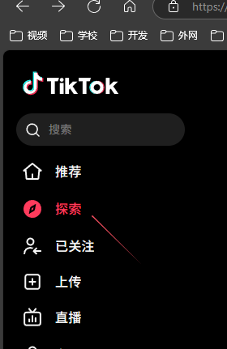
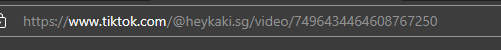
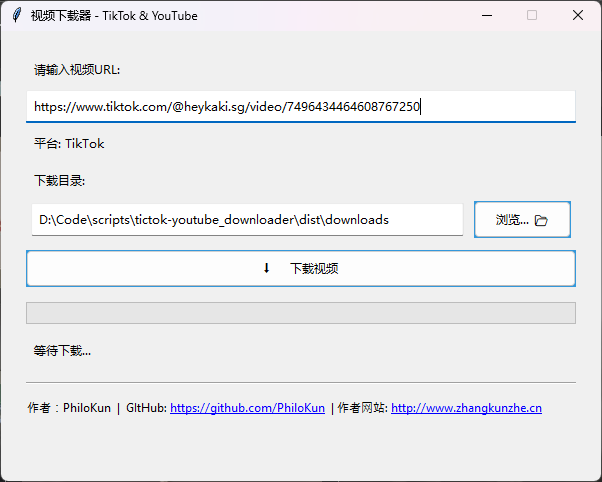
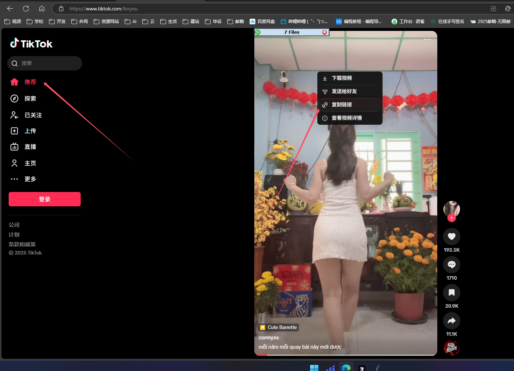
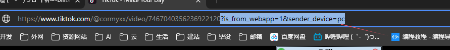
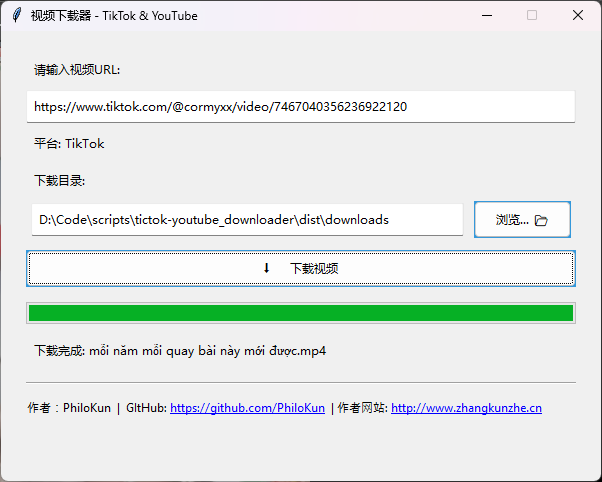

# TikTok & YouTube 视频无水印下载器 (GUI)

这是一个简单的图形用户界面应用程序，可以从TikTok和YouTube下载视频。

## 特性

- 支持TikTok视频下载（尝试去除水印）
- 支持YouTube视频下载（尝试下载最佳预合并格式）
- 无需安装 FFmpeg
- 图形用户界面 (GUI)
- 显示下载进度百分比
- 自动检测视频平台
- 可自定义下载目录
- 界面包含作者信息和可点击链接

## 安装

1. 确保已安装 Python 3.8 或更高版本。
2. 克隆或下载此仓库到本地。
3. 打开命令行/终端，进入项目目录 (`tictok-youtube_downloader`)。
4. 安装依赖包：

```bash
pip install -r requirements.txt
```

## 使用方法

- 直接运行图形用户界面：

```bash
python video_downloader_gui.py
```

- TikTok

1. 探索 选择一个要下载的视频



复制url



将url复制到下载器，点击下载即可



2. 推荐选择一个视频复制链接



复制的url 记得删除后面的

> ?is_from_webapp=1&sender_device=pc



将url复制到下载器，点击下载即可



- Youtube

## 打包命令

```
pyinstaller --onefile --windowed --icon="tiktok-youtube_downloader.ico" --name="TikTok-YouTube视频下载器" video_downloader_gui.py
```

## 使用说明

启动程序后，会显示主界面。

1. 在顶部的输入框中粘贴 TikTok 或 YouTube 视频的 URL。
3. 程序会自动检测平台并在下方显示。
4. 点击 "浏览... 📂" 按钮可以选择视频保存的目录（默认为程序所在目录下的 `downloads` 文件夹）。
5. 点击 "⬇️ 下载视频" 按钮开始下载。
6. 下方的进度条和状态文本会显示下载进度。
7. 下载完成后会弹出提示信息。
8. 界面底部包含作者信息，链接可点击跳转。

## 注意事项

- **无Cookie支持**：此版本已移除浏览器Cookie支持。对于需要登录或进行机器人验证才能访问的视频，下载可能会失败。
- **无FFmpeg合并**：此版本不依赖FFmpeg。对于YouTube上只有分离的视频和音频流的高质量版本，程序将尝试下载较低质量的预合并版本，可能无法获得最高分辨率。
- 此工具仅供个人学习和研究使用。
- 请尊重版权，不要下载或分享受版权保护的内容。
- 通过使用此工具，您同意遵守相关法律法规和平台的使用条款。
- 某些视频可能由于平台限制或其他原因无法下载。
- 如果遇到特定视频下载失败，可以尝试更新 `yt-dlp` 库 (`pip install --upgrade yt-dlp`)。

## 技术说明

本项目主要使用了以下技术：

- `yt-dlp`：强大的视频下载核心库。
- Python `tkinter`：用于创建图形用户界面。
- Python `threading`：用于在后台执行下载任务，防止界面冻结。

## 依赖

- Python 3.8+
- yt-dlp (>=2024.11.18)
- requests (==2.31.0)
- python-dotenv (==1.0.0) # yt-dlp 可能间接依赖
- tqdm (==4.66.2) # yt-dlp 可能间接依赖

(依赖项通过 `requirements.txt` 文件管理)

## 许可

本项目仅供学习研究使用。

## 贡献

欢迎提出问题和改进建议。
